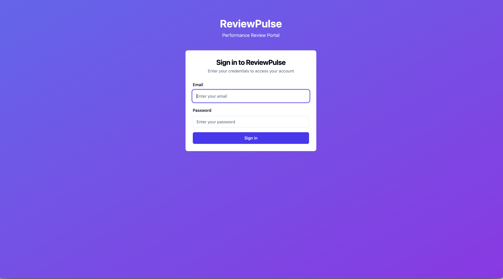

# Review Pulse Portal

A feedback portal for project managers and team leads to provide feedback to employees.

## About

This project is developed by Kombee Tech as a comprehensive feedback management system. It enables project managers and team leads to efficiently provide and track feedback for their team members.

## Getting Started

### Prerequisites

- Node.js (v18 or higher)
- npm or yarn
- Firebase account and project setup

### Installation

1. Clone the repository
2. Install dependencies:

```bash
npm install
```

3. Set up environment variables:
   - Copy `.env.example` to `.env`
   - Fill in your Firebase configuration values:
     ```
     VITE_FIREBASE_API_KEY=your_api_key_here
     VITE_FIREBASE_AUTH_DOMAIN=your_auth_domain_here
     VITE_FIREBASE_PROJECT_ID=your_project_id_here
     VITE_FIREBASE_STORAGE_BUCKET=your_storage_bucket_here
     VITE_FIREBASE_MESSAGING_SENDER_ID=your_messaging_sender_id_here
     VITE_FIREBASE_APP_ID=your_app_id_here
     ```

### Development

To start the development server:

```bash
npm run dev
```

### Building for Production

To build the project for production:

```bash
npm run build
```

## Security Considerations

### Environment Variables
- Never commit your `.env` file to version control
- Keep your Firebase credentials secure
- Use different Firebase projects for development and production
- Regularly rotate your API keys and credentials

### Firebase Security Rules
- Review and customize Firebase security rules in `firebase.rules`
- Implement proper authentication checks
- Set up appropriate data access controls

## Features

- Feedback management system
- Project manager and team lead dashboards
- Employee performance tracking
- Real-time feedback updates

## Contributing

Please read our contributing guidelines before submitting pull requests.

## License

This project is proprietary software owned by Kombee Tech.

## How can I edit this code?

There are several ways of editing your application:

**Use your preferred IDE**

The recommended way to work on this project is to use your preferred IDE locally. The only requirement is having Node.js & npm installed - [install with nvm](https://github.com/nvm-sh/nvm#installing-and-updating)

Follow these steps:

```sh
# Step 1: Clone the repository using the project's Git URL.
git clone <YOUR_GIT_URL>

# Step 2: Navigate to the project directory.
cd <YOUR_PROJECT_NAME>

# Step 3: Install the necessary dependencies.
npm i

# Step 4: Set up your environment variables
cp .env.example .env
# Edit .env with your Firebase credentials

# Step 5: Start the development server with auto-reloading and an instant preview.
npm run dev
```


**Edit a file directly in GitHub**

- Navigate to the desired file(s).
- Click the "Edit" button (pencil icon) at the top right of the file view.
- Make your changes and commit the changes.

**Use GitHub Codespaces**

- Navigate to the main page of your repository.
- Click on the "Code" button (green button) near the top right.
- Select the "Codespaces" tab.
- Click on "New codespace" to launch a new Codespace environment.
- Edit files directly within the Codespace and commit and push your changes once you're done.

## What technologies are used for this project?

This project is built with:

- Vite
- TypeScript
- React
- shadcn-ui
- Tailwind CSS
- Firebase (Authentication, Firestore, Storage)

## How can I deploy this project?

To deploy this project, you can use any of the following methods:

1. **Vercel**

   - Connect your GitHub repository
   - Configure build settings
   - Set up environment variables in Vercel dashboard
   - Deploy with automatic previews

2. **Netlify**

   - Connect your repository
   - Configure build settings
   - Set up environment variables in Netlify dashboard
   - Deploy with continuous integration

3. **Manual Deployment**
   - Build the project: `npm run build`
   - Deploy the contents of the `dist` folder to your hosting provider
   - Configure environment variables on your hosting platform

## Can I connect a custom domain?

Yes, you can connect a custom domain to your deployed application. The process varies depending on your hosting provider:

1. **Vercel**

   - Go to your project settings
   - Navigate to the Domains section
   - Add your custom domain
   - Follow the DNS configuration instructions

2. **Netlify**
   - Go to your site settings
   - Navigate to Domain management
   - Add your custom domain
   - Follow the DNS configuration instructions

For other hosting providers, please refer to their specific documentation for custom domain setup.

## Troubleshooting

### Firebase Configuration Issues
- Ensure all environment variables are properly set
- Verify Firebase project settings in Firebase Console
- Check Firebase security rules
- Ensure proper authentication setup

### Development Issues
- Clear browser cache if changes aren't reflecting
- Check console for error messages
- Verify Node.js version compatibility
- Ensure all dependencies are properly installed
